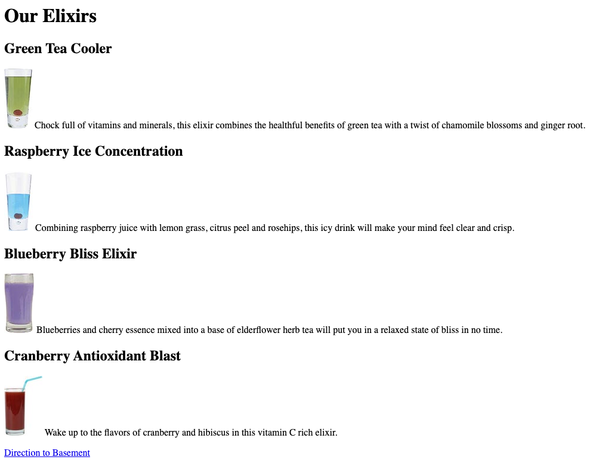
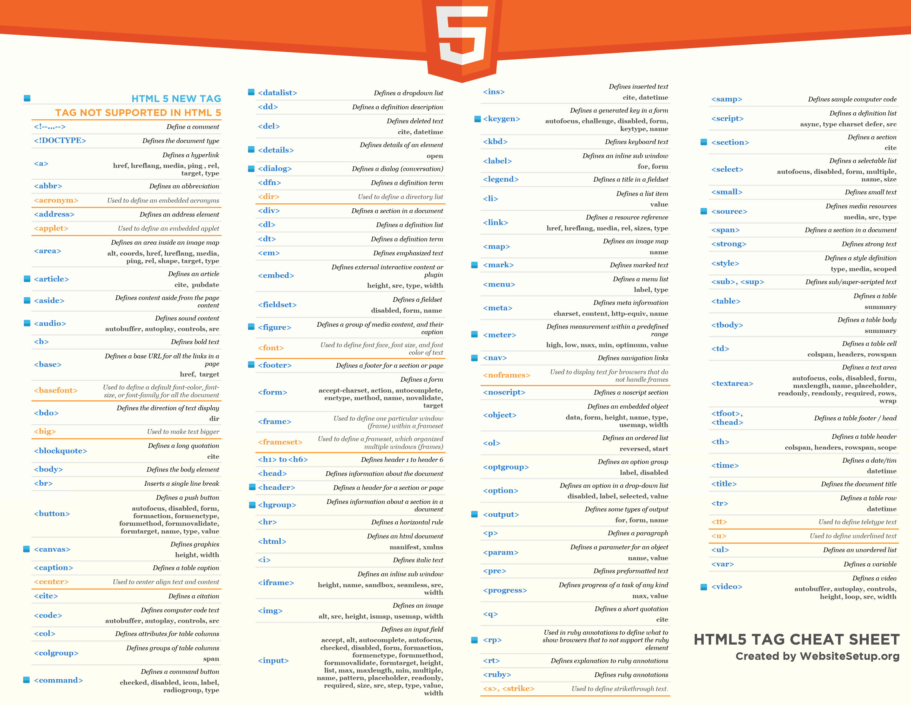

# html-block-elements-and-inline-elements

## HTML Blocks elements vs Inline elements

**The HTML elements can be categorized into two broader categories, inline and block elements.** 
**The block elements break the flow of content and start a new line - here are som examples of block element** 
**Two commonly used block elements are: `<h1>` and `
`.**  

### Example

`<h1>`Hello World`</h1>` 
`
`This is a paragraph.`
` 

**Here are the block-elements in HTML:** 
`<address>` `<article>` `<aside>` `<blockquote>` `<canvas>` `<dd>` `
` `<dl>` `<dt>` `<fieldset>` `<figcaption>` `<figure>` `<footer>` `<form>` `<h1>`-`<h6>` `<header>` `
` `<li>` `<main>`
`<nav>` `<ol>` `<pre>` `<section>` `<table>` `<tfoot>` `<ul>` `<video>`  

**An inline element does not start on a new line - it only takes up as much width as necessary.** 
**The `` element is a inline tag** 

### Example

``Hello World`` 

**Here are other inline-elements in HTML:** 

`<a>` `<abbr>` `<acronym>` `<b>` `<bdo>` `<big>` ` ` `<button>` `<cite>` `<code>` `<em>` `<i>` `` `<input>` `<label>` `<map>`
`<object>` `<output>` `<q>` `<samp>` `<script>` `<select>` `<small>` `` `<strong>` `` `` `<textarea>` `<time>`  

# Exercise

In this exercise you will learn to use the following HTML tags: `<html>`, `<head>`, `<body>`, `<meta charset>`, `<title>`, `<body>`, `<h1>`, `<h2>`, `
`, `` and `<a>` to build a web page. 

## Download/clone this [repo](https://github.com/muratkilic1978/html-block-elements-and-inline-elements) to your machine

Next open the **index.html** from the repository that you downloaded above. Now try to build a web page similar to the image below. Remember that all relevant HTML tags needed to solve this exercise is specified above and all images are placed in the img folder. **Remember that when you build a website you must always start with `<!DOCTYPE html>` on the first line.** 

 

## Here is an overview of the most popular HTML5 tags from WebsiteSetup.org

When you finally finish building a website identical to the image above, get into small groups (3-4 people) and identify which HTML tags from this exercise are block elements and which are inline elements. Publish your answer on this [Padlet](https://eaaa.padlet.org/mki/szojiuqxqj9ko8el)
